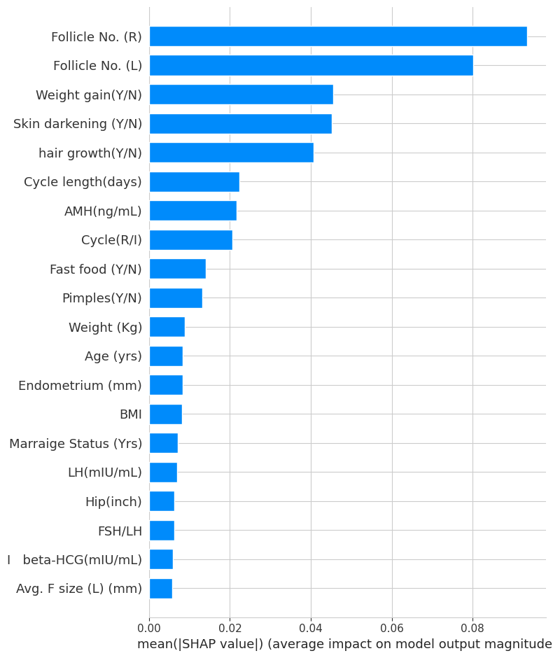
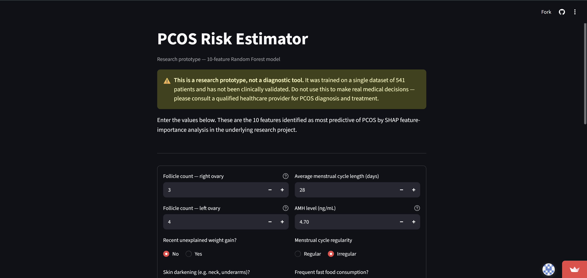
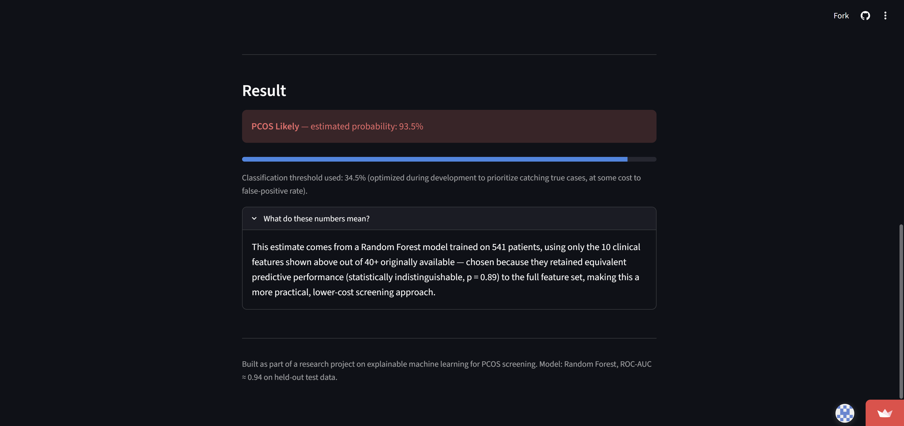

# PCOS Risk Prediction — Explainable Machine Learning for PCOS Screening

[](https://pcos-prediction-app-9d2phrtrhqdagalxyu7yts.streamlit.app/)
[](#)
[](LICENSE)

A machine learning pipeline for predicting Polycystic Ovary Syndrome (PCOS) from clinical and hormonal data — built not just to classify, but to test **which features actually matter, whether model choice matters, and whether the models' predicted probabilities can be trusted.**

**[Try the live interactive demo →](https://pcos-prediction-app-9d2phrtrhqdagalxyu7yts.streamlit.app/)**

---

## Overview

PCOS affects roughly 8–13% of women of reproductive age and remains frequently under- and mis-diagnosed, since no single test confirms it — diagnosis relies on combining multiple overlapping clinical, hormonal, and ultrasound findings (the Rotterdam criteria).

This project trains and rigorously evaluates three machine learning models (Logistic Regression, Random Forest, XGBoost) on a 541-patient clinical dataset, then goes beyond raw accuracy to ask three questions:

1. **Does model choice actually matter**, or only numerically? *(Tested with paired statistical significance testing.)*
2. **Can the feature set be reduced** without a real loss in performance? *(Tested with SHAP feature attribution + statistical validation.)*
3. **Is the most accurate model also the most trustworthy** in its predicted probabilities? *(Tested with calibration analysis.)*

## Key Findings

| Question | Finding |
|---|---|
| Does model architecture matter? | No — XGBoost vs. Random Forest difference is **not statistically significant** (p = 0.322) |
| Can features be reduced? | Yes — a **10-feature model performs statistically equivalent** to the full 44-feature model (p = 0.893) |
| Is the best model the most trustworthy? | No — **XGBoost (highest accuracy) was the least well-calibrated**; Logistic Regression (lower accuracy) was best-calibrated |
| What matters most clinically? | **Follicle count** was ranked the #1 predictor by all three model types, regardless of algorithm |

Full methodology, statistical tests, and discussion are in [`paper/PCOS_Paper.pdf`](paper/PCOS_Paper.pdf).

## Results Summary

| Model | Accuracy | Precision | Recall | F1 | ROC-AUC |
|---|---|---|---|---|---|
| Logistic Regression | 0.890 | 0.816 | 0.861 | 0.838 | 0.951 |
| Random Forest (all features) | 0.917 | 0.966 | 0.778 | 0.862 | 0.949 |
| XGBoost (all features) | 0.936 | 0.968 | 0.833 | 0.896 | **0.956** |
| Random Forest (top 10 features) | 0.917 | 0.909 | 0.833 | 0.870 | 0.943 |

Full results table, robustness checks, and confidence analysis: [`results/`](results/).

## Feature Importance (SHAP)

The 10 features below retain statistically equivalent performance to the full 44-feature model, while being far cheaper and faster to collect clinically:



| Rank | Feature | Rank (RF) | Rank (XGBoost) | Rank (LogReg) |
|---|---|---|---|---|
| 1 | Follicle No. (Right ovary) | 1 | 1 | 1 |
| 2 | Follicle No. (Left ovary) | 2 | 3 | 7 |
| 3 | Weight gain (Y/N) | 3 | 4 | 4 |
| 4 | Skin darkening (Y/N) | 4 | 5 | 6 |
| 5 | Hair growth (Y/N) | 5 | 2 | 2 |
| 6 | Cycle length (days) | 6 | 9 | 18 |
| 7 | AMH (ng/mL) | 7 | 7 | 22 |
| 8 | Cycle regularity | 8 | 6 | 5 |
| 9 | Fast food consumption (Y/N) | 9 | 15 | 24 |
| 10 | Pimples (Y/N) | 10 | 8 | 8 |

## Interactive Demo

A web app was built with the reduced 10-feature model and deployed publicly:

**[https://pcos-prediction-app-9d2phrtrhqdagalxyu7yts.streamlit.app/](https://pcos-prediction-app-9d2phrtrhqdagalxyu7yts.streamlit.app/)**

<p align="center">
  
  
</p>

> ⚠️ This is a research prototype, not a diagnostic tool. Trained on 541 patients from a single source; not clinically validated.

## Repository Structure

```
├── notebooks/
│   └── PCOS_Prediction_Organized.ipynb   # Full pipeline: EDA → models → SHAP → calibration
├── app/
│   ├── app.py                            # Streamlit interactive demo
│   └── requirements.txt
├── paper/
│   ├── PCOS_Paper.pdf                    # Full IEEE-format research paper
│   ├── main.tex                          # LaTeX source
│   └── figs/                             # All figures used in the paper
├── figures/                              # Standalone copies of key result figures
├── results/                              # Raw metric/statistical test outputs (CSV/TXT)
└── README.md
```

## Methodology

1. **Data**: 541 patients, 44 clinical/hormonal/ultrasound features, publicly available PCOS dataset.
2. **Preprocessing**: median imputation, stratified 80/20 train-test split.
3. **Models**: Logistic Regression, Random Forest, XGBoost — 5-fold cross-validated.
4. **Statistical testing**: paired t-tests on CV folds to confirm whether performance differences are real.
5. **Explainability**: SHAP values computed independently for all three models; cross-model feature-rank agreement analyzed.
6. **Feature reduction**: top-10 features (by Random Forest SHAP ranking) statistically validated against the full model.
7. **Threshold optimization**: precision-recall trade-off analysis to prioritize diagnostic recall over the default 0.5 cutoff.
8. **Calibration analysis**: assessed whether predicted probabilities reflect true likelihoods, across all three models.
9. **Deployment**: reduced model shipped as a public interactive Streamlit app.

Full detail, equations, and honest discussion of limitations (including a documented attempt at external validation that was infeasible due to dataset incompatibility) are in the paper.

## Running Locally

**Notebook:**
```bash
# Open notebooks/PCOS_Prediction_Organized.ipynb in Jupyter or Google Colab
# Requires: pandas, numpy, scikit-learn, xgboost, shap, matplotlib, seaborn
```

**App:**
```bash
cd app
pip install -r requirements.txt
streamlit run app.py
```
Note: `app.py` expects a trained model file (`pcos_reduced_model.pkl`) and feature-order file (`pcos_feature_order.pkl`) in the same directory — generate these by running the final cells of the notebook.

## Dataset

[PCOS Dataset (Kaggle)](https://www.kaggle.com/datasets/prasoonkottarathil/polycystic-ovary-syndrome-pcos) by Prasoon Kottarathil.

## Citation

If referencing this work, please cite the accompanying paper (see [`paper/PCOS_Paper.pdf`](paper/PCOS_Paper.pdf) for full reference list and methodology).

## Author

**Habiba Abdelmeneem Ramadan Abdelmeneem**
Systems and Biomedical Engineering, Faculty of Engineering, Cairo University

## License

This project is licensed under the MIT License — see [LICENSE](LICENSE) for details.

## Disclaimer

This project is a research and educational prototype. It is **not a validated medical diagnostic tool** and should not be used for real clinical decision-making. Always consult a qualified healthcare provider for PCOS diagnosis and treatment.
